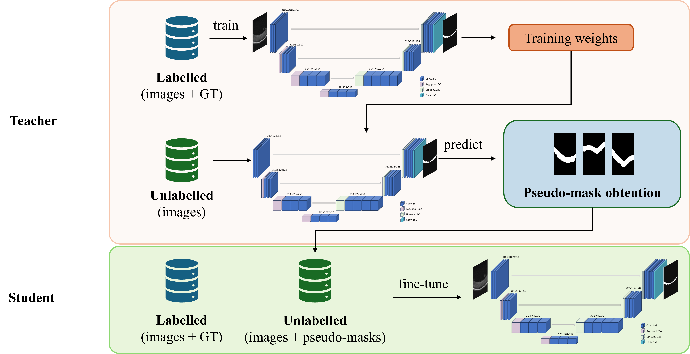

# A Curated OCT Dataset of Ex-Vivo Mice Retina for Deep Learning Models



## Description
Optical coherence tomography (OCT) is a fundamental technology in ophthalmic research, providing high-resolution 3D cross-sections of the retina. Algorithms for retinal cell layer segmentation provide critical insights into retinal structure and pathology. While deep learning-based segmentation methods have proven effective in analysing human retinal OCT B-scans, their application to rodent retinas remains limited due to the lack of publicly available OCT datasets. This limitation constrains the development of AI models for preclinical animal studies aimed at improving retinal disease diagnosis and treatment. 

To address this, we present a **novel dataset** of OCT volumes from ex-vivo rodent retinas embedded in aqueous media—a sample type rarely represented in existing datasets, which mainly focus on human retinas. Our dataset comprises 22 OCT volumes to support segmentation of the **upper retinal cell layers**, essential for assessing retinal health and disease progression. Due to limited expert annotations, we adopted a **teacher-student training strategy** to generate pseudo-masks, enabling validation with minimal expert input. This dataset enables scalable AI applications in rodent retinal imaging for preclinical research.

---

## Usage

### 1. Clone the repository

```bash
git clone https://github.com/cvblab/SEQUOIA-RodentOCT

```

### 2. Install dependencies

Make sure you have Python 3.8+ installed. Then run:

```bash
pip install -r requirements.txt
```


### 3. Code Structure

The repository is divided into three main folders:

```
SEQUOIA-RodentOCT/
│
├── 1_preprocessing/              # MATLAB scripts to load OCT volumes and convert them to .mat format
│   └── load_oct_to_mat.m         # Main function for preprocessing volumes
│
├── 2_segmentation_model/         # PyTorch implementation of the teacher-student segmentation strategy
│   ├── main.py                   # Main script for training
│   ├── model.py                  # U-Net architecture.
│   ├── train.py                  # Training script.
│   ├── dataset.py                # Contains the main functions to load the data.
│   ├── inference.py              # Inference and pseudo-mask generation.
│   └── compute_metrics.py        # Script for the evaluation.
│
└── 3_postprocessing/             # MATLAB scripts for postprocessing pseudo-masks
    └── pseudo_mask_refinement.m  # Code for refining the pseudo-masks obtained during inference.
```
> **Note:** Some preprocessing steps are written in MATLAB. You will need a compatible version of MATLAB R2019b or superior to execute those scripts.
### 4. Run the code

To train the model, run the following command in the terminal:

```bash
python main.py
```

Make sure you configure `main.py` or individual scripts with the correct paths to your data and model files.

To evaluate its performance, run the following command in the terminal:

```bash
python compute_metrics.py
```
---

## Data source

The data used is available at Figshare: LINK.

---

## Citation

If you use this dataset, code, or methodology in your research, please cite:

```
@article{SEQUOIA-RodentOCT,
  title={A Curated OCT Dataset of Ex-Vivo Mice Retina for Deep Learning Models},
  author={Fernando Garc\'ia-Torres, \'Alvaro Barroso, Roc\'io del Amor, Sandra Morales, Steffi Ketelhut, Peter Heiduschka, Björn Kemper, Jürgen Schnekenburger, Valery Naranjo},
  journal={To be updated upon publication},
  year={2025}
}
```

*A DOI or final citation will be added once the dataset is officially published.*


